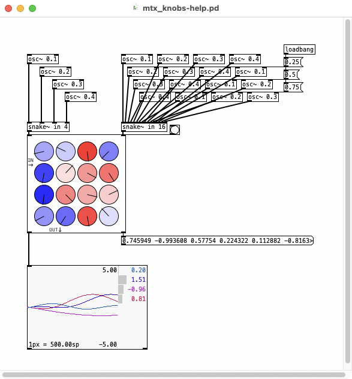

# [mtx_knobs]
Pure Data (Pd) matrix mixer with signal input support for coefficients

## inlets

1. mc input signal
2. coefficient list or mc signal. bang for list output

## outlets

1. mixed signal
2. coefficients list output on bang

## arguments

1. inputs (rows)
2. outputs (colums)
3. min value
4. max value

## dependencies

* relies on some objects from https://github.com/ben-wes/pd-quatkram
